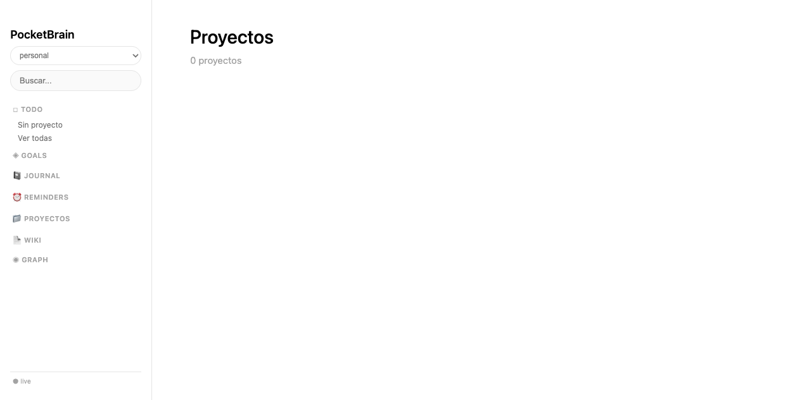
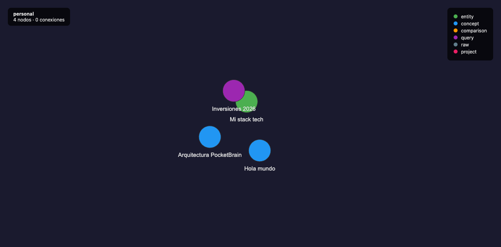
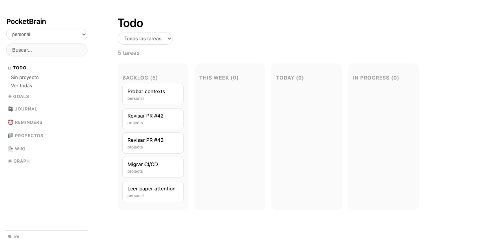
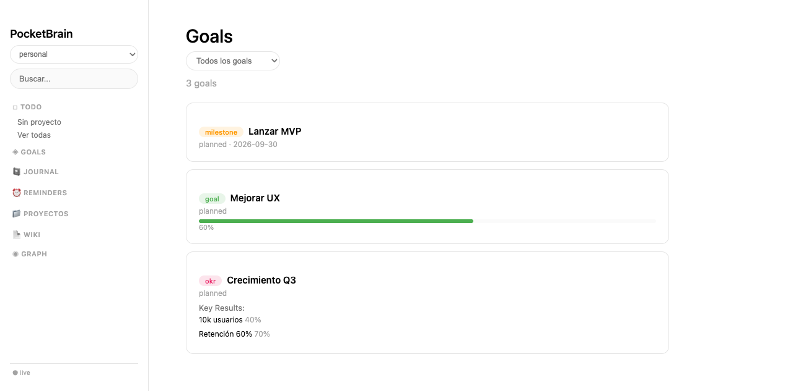

# Hermes Skills

Skills para [Hermes Agent](https://github.com/NousResearch/hermes-agent).

## Instalacion

```bash
hermes skills tap add git@github.com:alvarolizama/hermes-skills.git
hermes skills install pocketbase
hermes skills install pocketbrain
```

---

## `pocketbase` — Cliente PocketBase API

Cliente generico para interactuar con la API REST de PocketBase. **No lee variables de entorno.**
Recibe `host`, `email`, `password` como parametros explicitos. Cada skill consumidor
carga sus propias env vars y las pasa.

```python
from pb import quick_pb
pb = quick_pb('http://localhost:8090', 'admin@example.com', 'secret')
records = pb.list('mi_coleccion', filter="status='active'")
```

---

## `pocketbrain` — Segundo Cerebro Digital

Knowledge base multi-contexto sobre PocketBase. 12 colecciones, servidor web live,
trazabilidad completa.

### Arquitectura

```
PocketBrain (skill)
  +-- PocketBase instance
        +-- contexts collection
              +-- "personal"  -> pages, todos, journal, goals...
              +-- "projects"  -> pages, todos, journal, goals...
```

Cada **contexto** es un ambito independiente con sus propias paginas, tareas,
metas, diario y archivos. Los grafos y el servidor web son per-contexto.

### Variables de entorno

El skill `pocketbrain` usa sus propias variables en `~/.hermes/.env`:

```
POCKETBRAIN_HOST=http://tu-servidor:8090
POCKETBRAIN_EMAIL=admin@example.com
POCKETBRAIN_PASSWORD=***
```

Independientes de las variables `POCKETBASE_*` que pueda usar el skill `pocketbase`.

### Quick Start

```bash
# 1. Crear colecciones (una vez)
cd pocketbrain/scripts
python3 -c "from brain import _pocketbrain_pb, setup_contexts; setup_contexts(_pocketbrain_pb())"

# 2. Servidor web live
python3 brain_web.py --brain personal
# -> http://localhost:8080

# 3. Exportar a markdown
python3 sync.py --brain personal --full
```

### Screenshots

| Web UI | Graph | Kanban | Goals |
|--------|-------|--------|-------|
|  |  |  |  |

### Desde el Agente

```python
from brain import Brain

# Conectar a un contexto
brain = Brain('personal')

# Paginas con [[wikilinks]]
brain.create_page("Tema", body="## Ideas\n...", page_type="concept")
brain.search("machine learning")

# Tareas (kanban: backlog -> this week -> today -> in progress -> done)
brain.create_todo("Revisar PR", domain="projects")

# Goals, milestones y OKRs
brain.create_goal("Lanzar MVP", type="milestone", deadline="2026-09-30")
brain.complete_goal(id, retrospective="Entregado a tiempo.")

# Proyectos (pages con page_type="project")
brain.create_page("App Movil", page_type="project")

# Diario
brain.journal_write("## Hoy\n- Avance en [[proyecto-x]]", mood="great")

# Recordatorios
brain.create_reminder("Reunion", date="2026-06-15", time="10:00")
```

### 12 Colecciones

| Coleccion | Para |
|-----------|------|
| `contexts` | Contextos independientes (personal, projects, ...) |
| `brain_pages` | Paginas markdown con `[[wikilinks]]` |
| `brain_todos` | Tareas con kanban |
| `brain_goals` | Goals, milestones, OKRs con retrospectiva |
| `brain_reminders` | Recordatorios con fecha/hora |
| `brain_journal` | Diario |
| `brain_deliverables` | Entregables versionados |
| `brain_files` | Archivos adjuntos |
| `brain_tags`, `brain_domains` | Organizacion |
| `brain_page_versions` | Historial de cambios |
| `brain_log` | Bitacora con trazabilidad (agent + user) |

### Scripts

| Script | Uso |
|--------|-----|
| `brain_web.py` | Servidor web live con 7 secciones (ThreadingHTTPServer) |
| `brain.py` | Cliente Python para agentes |
| `sync.py` | Export a markdown local |
| `graph.py` | Graph HTML standalone per-contexto |

---

## Autor

Alvaro L. — [@alvarolizama](https://github.com/alvarolizama)
