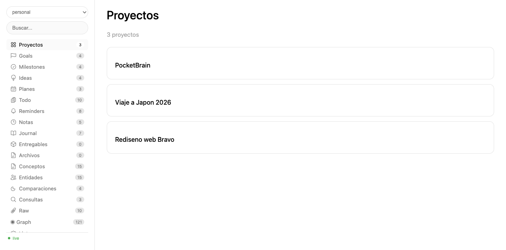
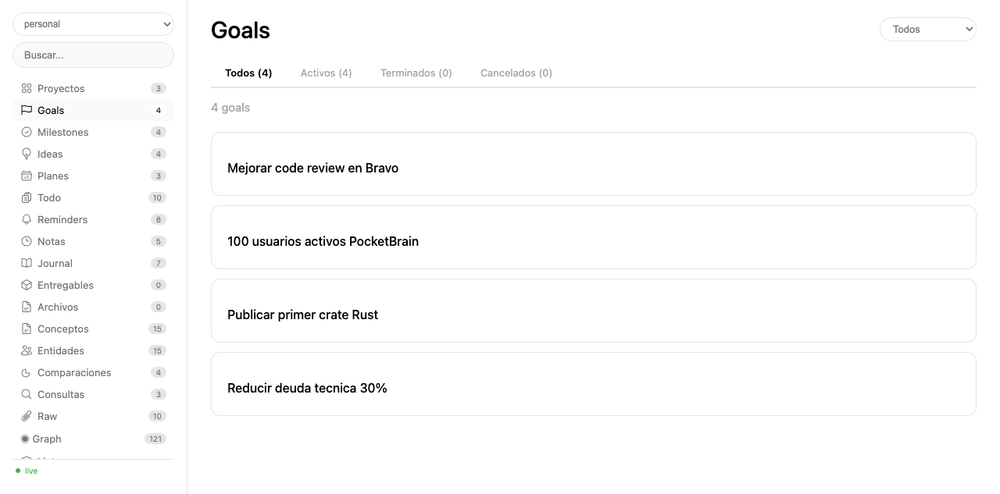
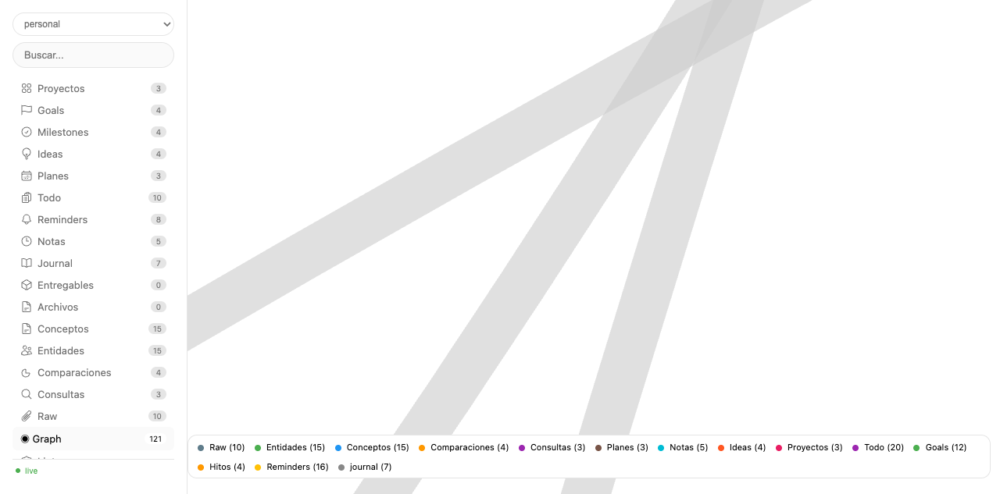

# Hermes Skills

Skills para [Hermes Agent](https://github.com/NousResearch/hermes-agent) by Nous Research.

## Instalacion

```bash
hermes skills tap add git@github.com:alvarolizama/hermes-skills.git
hermes skills install pocketbase
hermes skills install pocketbrain
```

---

## `pocketbase` — Cliente PocketBase API

Cliente generico para interactuar con la API REST de PocketBase. **No lee variables de entorno.**
Recibe `host`, `email`, `password` como parametros explicitos. Cada skill consumidor
carga sus propias env vars y las pasa.

```python
from pb import quick_pb
pb = quick_pb('http://localhost:8090', 'admin@example.com', 'secret')
records = pb.list('mi_coleccion', filter="status='active'")
```

Ver [`pocketbase/README.md`](pocketbase/README.md) para documentacion completa de la API (auth, records, files, backups, batch, realtime).

---

## `pocketbrain` — Segundo Cerebro Digital

Knowledge base multi-contexto sobre PocketBase. 12 colecciones, servidor web live,
trazabilidad completa, 16 tipos de página interconectados con grafos.


*Vista principal con proyectos, sidebar de navegación por tipo, y conteos.*

### Features

- **16 page types**: entity, concept, comparison, query, raw, project, plan, note, idea, todo, goal, milestone, okr, reminder, journal, file, deliverable
- **Auto-linking**: `[[wikilinks]]` en el body resuelven slugs existentes y generan backlinks automáticos
- **Auto-suggest page_type**: el agente infiere el tipo de página del título y contenido
- **Interactive graph**: grafos con vis.js, nodos coloreados por tipo, filtros por leyenda
- **Project management**: proyectos con goals, milestones, todos kanban, reminders, journal
- **Hash-based URLs**: toda navegación genera URLs compartibles (`#tab=goals&gstatus=active`)
- **Live status**: heartbeat polling con indicador live/offline
- **Multi-contexto**: 5 contextos (personal, projects, bravo, learning, health)


*Vista de goals con filtros de status y select de proyecto.*

### Quick Start

```bash
# 1. Crear colecciones (una vez)
cd pocketbrain/scripts
python3 -c "from brain import _pocketbrain_pb, setup_contexts; setup_contexts(_pocketbrain_pb())"

# 2. Servidor web live
python3 brain_web.py --context personal --port 8899
# → http://localhost:8899

# 3. Exportar a markdown
python3 sync.py --context personal --full
```

### Desde el Agente

```python
from brain import Brain

brain = Brain('personal')

# Páginas de conocimiento
brain.create_page("GPT-4o", body="Modelo multimodal de [[OpenAI]]", page_type="entity")
brain.create_page("Arquitectura hexagonal", body="Patron de diseno...", page_type="concept")

# Proyectos y tareas
brain.create_page("Migración K8s", page_type="project", domain="bravo")
brain.create_todo("Configurar CI/CD", domain="bravo")
brain.create_goal("Migrar 50% servicios", type="milestone", deadline="2026-09-30")
brain.move_todo(todo_id, "in progress")
brain.journal_write("## Hoy\n- Avance en [[proyecto-x]]")
brain.create_reminder("Reunión", date="2026-12-25", time="10:00")
```

### Arquitectura

- **Backend**: PocketBase en `zima.vpn.cloud:18090`
- **Frontend**: SPA vanilla JS con vistas por tipo de página
- **CSS**: Design tokens con variables CSS, dark mode-ready
- **Graph**: vis.js Network con física force-atlas-2
- **Auth**: autenticación por contexto (no por usuario)

### Hash URLs

Toda navegación genera URLs con hash para compartir y bookmark:

| Vista | Hash |
|-------|------|
| Projects | `#tab=projects` |
| Goals | `#tab=goals` |
| Goals con filtro | `#tab=goals&gstatus=active` |
| Reminders semanales | `#tab=reminders&rstatus=week` |
| Proyecto detalle | `#project=slug` |
| Proyecto tab | `#project=slug&ptab=goals` |
| Wiki page | `#tab=wiki&page=slug` |
| Wiki page tab | `#tab=wiki&page=slug&wtab=backlinks` |


*Grafo interactivo con nodos coloreados por tipo y leyenda de filtros.*

### 16 Page Types

| Tipo | Uso | Ejemplo |
|------|-----|---------|
| `entity` | Personas, empresas, productos | "OpenAI", "Álvaro" |
| `concept` | Temas, técnicas, patrones | "Microservicios" |
| `comparison` | Comparativas | "React vs Vue" |
| `query` | Preguntas respondidas | "¿Cómo optimizar SQL?" |
| `raw` | Fuentes externas | "Paper Attention Is All You Need" |
| `project` | Proyectos con entregables | "Migración K8s" |
| `plan` | Roadmaps, estrategias | "Roadmap Q1" |
| `note` | Apuntes, minutas | "Nota reunión diseño" |
| `idea` | Brainstorming | "Idea: app fitness" |
| `todo` | Tareas individuales | "Revisar PR" |
| `goal` | Objetivos amplios | "Mejorar rendimiento" |
| `milestone` | Hitos con deadline | "Lanzar MVP Sep" |
| `reminder` | Recordatorios | "Reunión 10am" |
| `journal` | Diario por día | "Journal 2026-06-10" |
| `file` | Archivos adjuntos | "Diagrama v2.pdf" |
| `deliverable` | Entregables versionados | "Specs API v1.0" |

---

## Autor

Alvaro L. — [@alvarolizama](https://github.com/alvarolizama)
