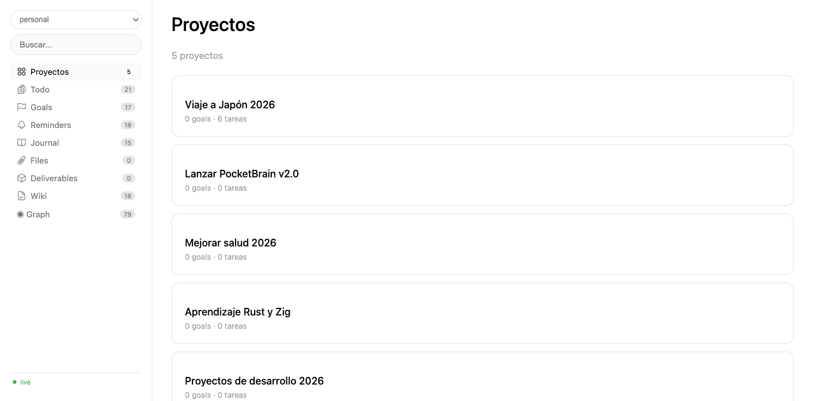
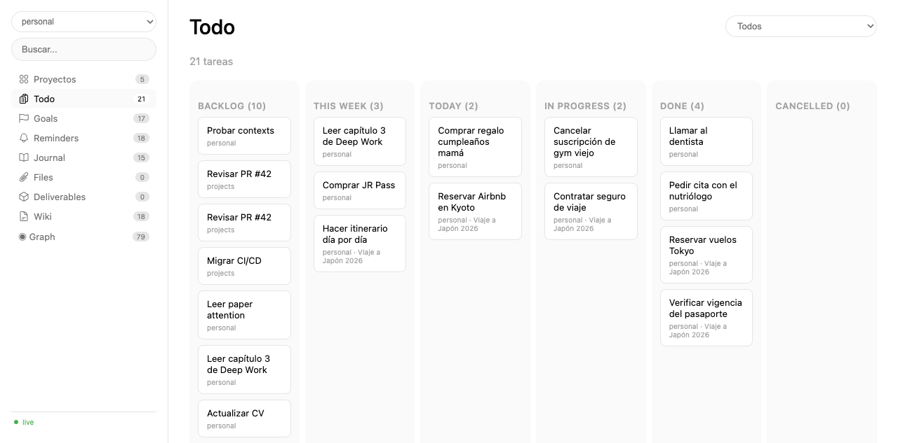
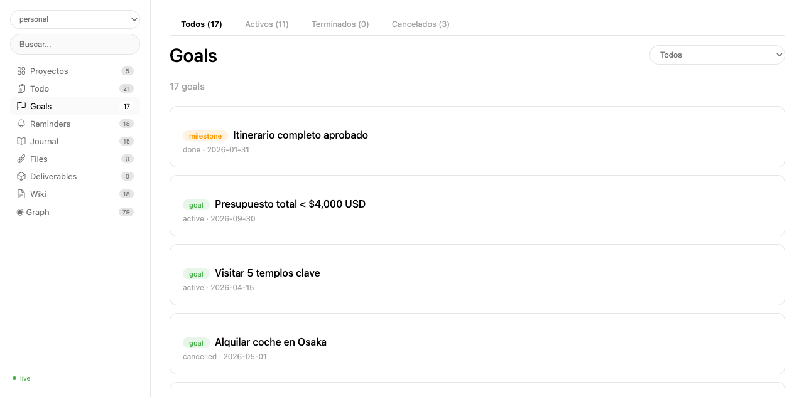
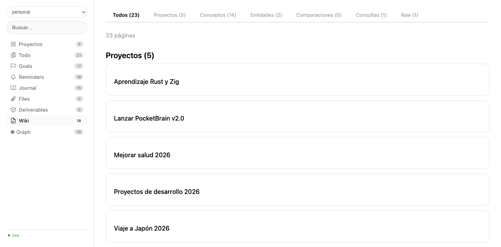
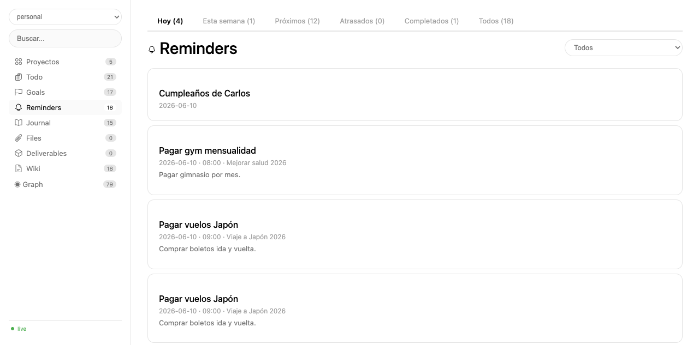
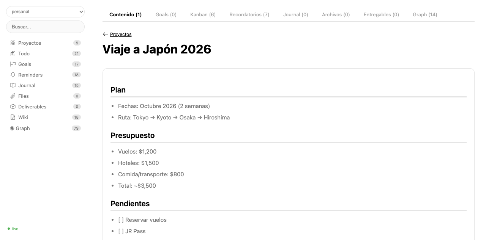
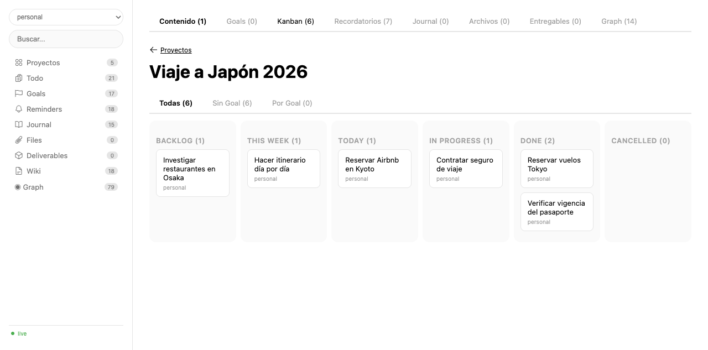
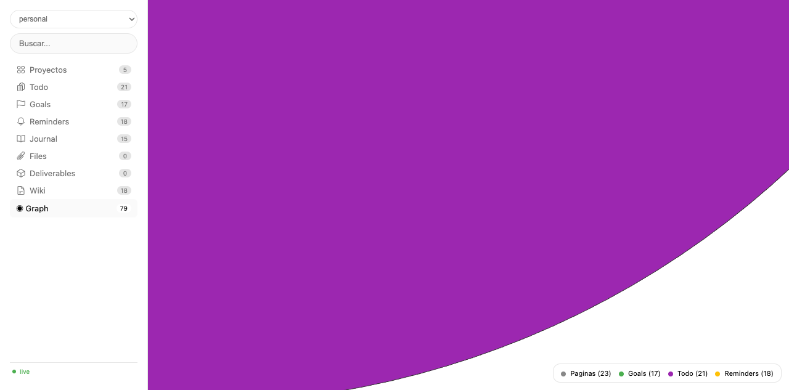

# PocketBrain

Un segundo cerebro digital multi-contexto. Backend en PocketBase (12 colecciones), servidor web live, y un cliente Python para que los agentes de IA escriban conocimiento gestionen tareas y proyectos.

Los agentes guardan. Tú consultas.

## Screenshots

### Proyectos
Vista principal con tarjetas de proyecto, conteo de goals, tareas y recordatorios.



### Kanban de Tareas
Board completo por status: backlog, this week, today, in progress, done, cancelled.



### Goals
Goals filtrables por estado: activos, terminados, cancelados. Cada uno con tipo (goal, milestone, okr), deadline y proyecto.



### Wiki
Páginas markdown con `[[wikilinks]]`, filtros por tipo (proyectos, conceptos, entidades, comparaciones).



### Recordatorios
Recordatorios con fecha y hora, filtrables por hoy, esta semana, próximos, atrasados.



### Detalle de Proyecto
Vista completa de un proyecto: contenido markdown, tabs de goals, kanban por goal, recordatorios, archivos, entregables y grafo de relaciones.



### Kanban por Proyecto
Tareas del proyecto agrupadas en columnas por status. Filtros: todas, sin goal, por goal.



### Grafo de Conocimiento
Visualización de nodos (páginas, goals, tareas, recordatorios) y sus relaciones via vis.js.



---

## Uso con Scripts (Flujos Agentivos)

PocketBrain está diseñado para ser usado **100% por scripts** desde el agente. No necesitas abrir la UI si no quieres. El flujo de trabajo:

1. **El agente escribe** conocimiento, tareas, goals, recordatorios.
2. **El agente consulta** qué hay que hacer, qué está activo, qué pasó.
3. **La UI web** es solo para consulta rápida cuando tú quieras.

### Setup en 2 pasos

```bash
# 1. Variables de entorno en ~/.hermes/.env
POCKETBRAIN_HOST=http://localhost:8090
POCKETBRAIN_EMAIL=admin@example.com
POCKETBRAIN_PASSWORD=***

# 2. Crear colecciones (una vez)
cd scripts
python3 -c "from brain import _pocketbrain_pb, setup_contexts; setup_contexts(_pocketbrain_pb())"
```

### Flujo 1: Guardar conocimiento

```python
from brain import Brain

brain = Brain('personal')

# Crear una página wiki
brain.create_page(
    "Arquitectura de cache",
    body="## Cache de write-through vs write-back\n\n...",
    page_type="concept",
    domain="bravo",
    tags=["backend", "perf"]
)

# Agregar a una página existente
brain.append_to_page("arquitectura-de-cache", "- También sirve para rate limiting", heading="Notas")

# Buscar
brain.search("cache")
```

### Flujo 2: Gestión de Proyectos

```python
# Crear proyecto
brain.create_page(
    "App Móvil",
    body="## MVP\n\n- Tres pantallas\n- Auth con OAuth",
    page_type="project",
    domain="projects"
)

# Crear goals ligados al proyecto (por slug)
brain.create_goal(
    "Lanzar MVP",
    type="milestone",
    project_slug="app-movil",
    deadline="2026-09-30"
)

# Tareas del proyecto
brain.create_todo("Diseñar UI", domain="projects", page_slug="app-movil")
brain.create_todo("Setup backend", domain="projects", page_slug="app-movil")

# Recordatorios del proyecto
brain.create_reminder("Demo con cliente", date="2026-07-15", time="10:00", page_slug="app-movil")
```

### Flujo 3: Día a día

```python
# ¿Qué tengo para hoy?
brain.todos(status="today")

# Atrasados
brain.todos(status="late")

# Recordatorios de hoy
brain.reminders(date="today")

# Mover tarea a done
brain.move_todo("TODO_ID", "done")

# Diario automático
brain.journal_write("## Hoy\n- Terminé el PR #42\n- [[Arquitectura de cache]]", mood="great")

# Listar entrys recientes del diario
brain.journal_entries(days=7)
```

### Flujo 4: Auditoría y mantenimiento

```python
# Links rotos, huérfanos, etc.
brain.lint()

# Todo el catálogo
brain.index()

# Últimas operaciones (trazabilidad completa)
brain.recent_logs(20)
```

---

## Arquitectura

12 colecciones en PocketBase. Ver `references/schema.md` para detalle completo.

| Colección | Para |
|-----------|------|
| `contexts` | Contextos independientes (personal, projects, etc.) |
| `brain_pages` | Páginas markdown con `[[wikilinks]]` |
| `brain_todos` | Tareas (backlog → today → done) |
| `brain_goals` | Goals, milestones, OKRs con retrospectiva |
| `brain_reminders` | Recordatorios con fecha/hora |
| `brain_journal` | Diario (una entrada por día) |
| `brain_deliverables` | Entregables versionados |
| `brain_files` | Archivos adjuntos |
| `brain_tags`, `brain_domains` | Organización |
| `brain_page_versions` | Historial de cambios |
| `brain_log` | Bitácora — quién hizo qué y para quién |

---

## Scripts

| Script | Uso |
|--------|-----|
| `brain_web.py` | Servidor web live. `python3 brain_web.py --port 8899 --context personal` |
| `brain.py` | Cliente Python para agentes |
| `sync.py` | Export a markdown con frontmatter YAML |
| `graph.py` | Grafo HTML standalone per-contexto |
| `validate_ui.py` | Valida `web_ui.html` con `node --check` |

---

## Tracing

Cada operación registra quién (agente) y para quién (usuario). La tabla `brain_log` tiene `details: {agent, requested_by}` automático.

---

## Estado

Live. Funcionando en http://localhost:8899 con el contexto `personal`.

