# PocketBrain

Un segundo cerebro digital multi-contexto. Backend en PocketBase, servidor web live, y cliente Python para que los agentes de IA escriban conocimiento, gestionen tareas y proyectos.

Los agentes guardan. Tú consultas.

---

## Screenshots

| Proyectos | Project Detail | Project Graph |
|-----------|----------------|---------------|
| 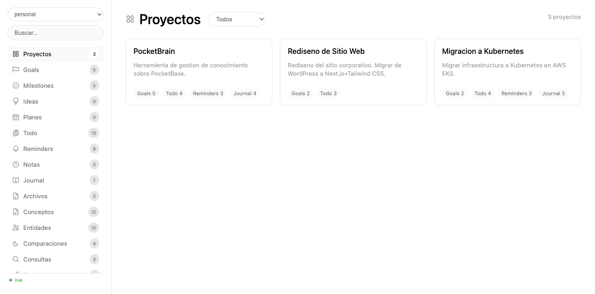 | 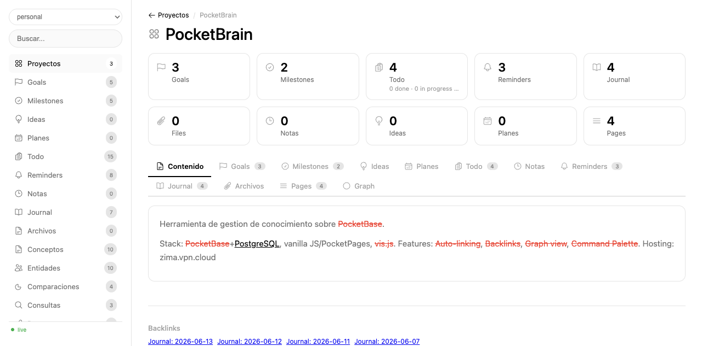 | 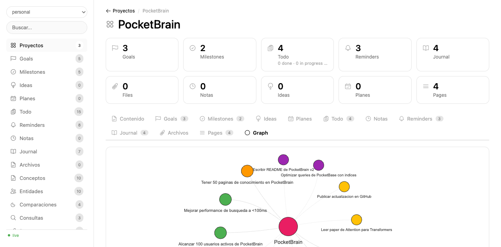 |

| Todo | Project Kanban | Goals |
|------|----------------|-------|
| 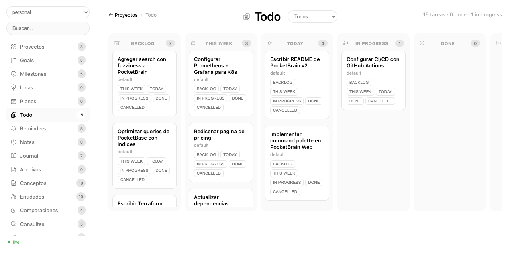 | 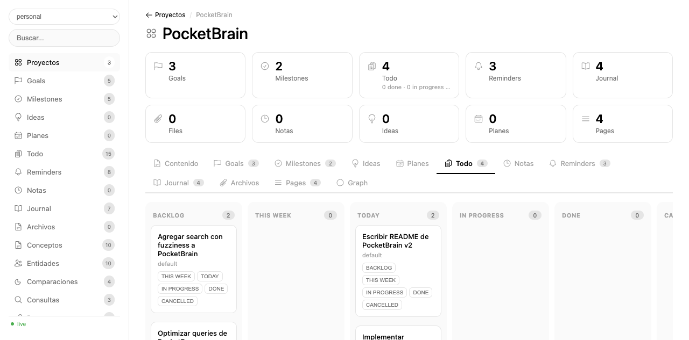 | 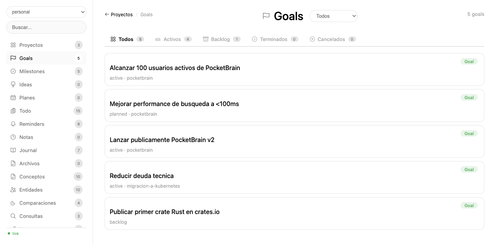 |

| Reminders | Journal | Wiki |
|-----------|---------|------|
| 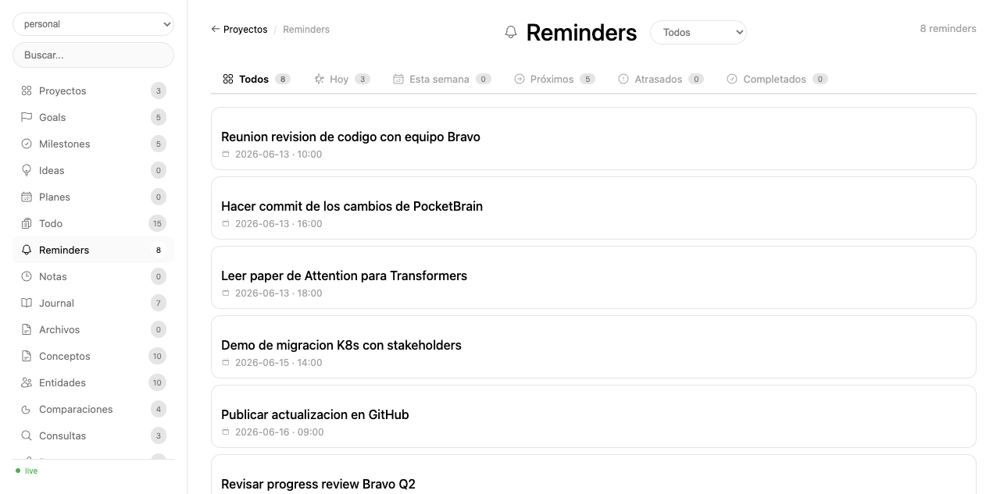 | 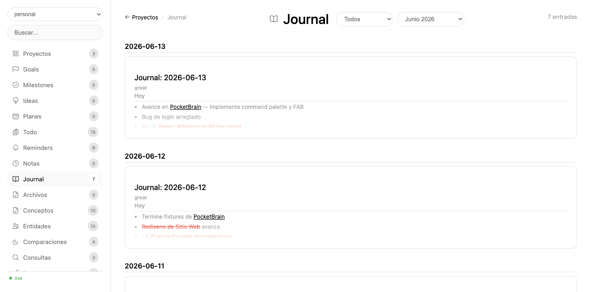 | 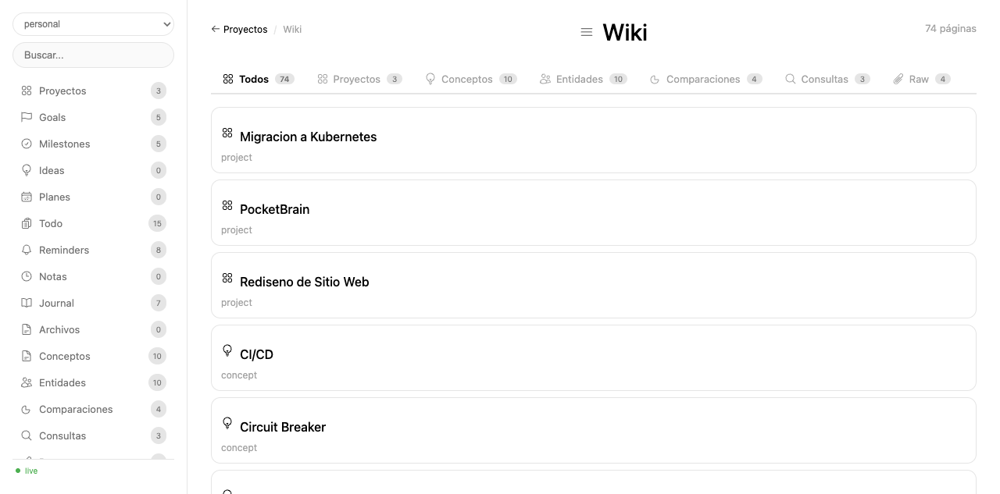 |

| Wiki Page | Graph Global | Lint |
|-----------|--------------|------|
| 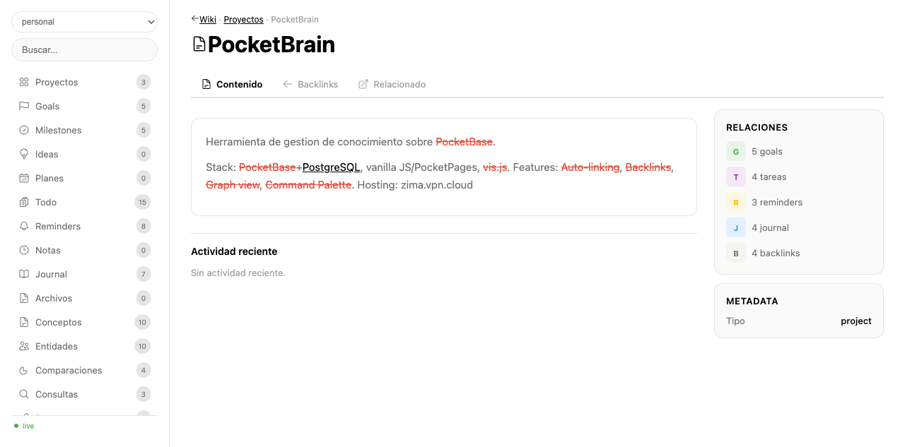 | 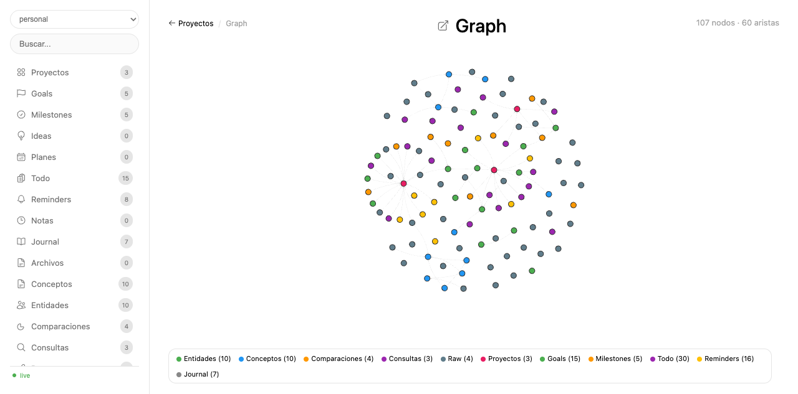 | 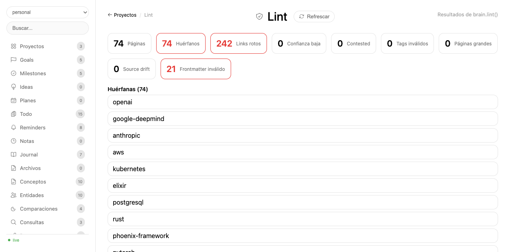 |

---

## Features

- **15 page types**: entity, concept, comparison, query, raw, project, plan, note, idea, todo, goal, milestone, okr, reminder, journal, file
- **Auto-linking**: `[[wikilinks]]` resuelven slugs existentes y generan backlinks automáticos
- **Auto-suggest page_type**: el agente infiere el tipo de página del título y contenido
- **Interactive graph**: grafos con vis.js, nodos coloreados por tipo
- **Project management**: proyectos con goals, milestones, todos kanban, reminders, journal, archivos, pages y graph propio
- **Hash-based URLs**: toda navegación genera URLs compartibles
- **Multi-contexto**: cada contexto es un silo independiente; se crean los que se requieran
- **Consistente UI**: iconos Heroicons en headers, tabs, breadcrumbs y cards

---

## Quick Start

```bash
cd ~/.hermes/skills/productivity/pocketbrain/scripts

# Crear colecciones (una vez)
python3 -c "from brain import _pocketbrain_pb, setup_contexts; setup_contexts(_pocketbrain_pb())"

# Servidor web live
python3 brain_web.py --context <context_name> --port 8899
# → http://localhost:8899
```

### Desde el agente

```python
from brain import Brain

brain = Brain('<context_name>')

# Páginas de conocimiento
brain.create_page("GPT-4o", body="Modelo multimodal de [[OpenAI]]", page_type="entity")

# Proyectos y tareas
brain.create_page("Migración K8s", page_type="project")
brain.create_todo("Configurar CI/CD")
brain.create_goal("Migrar 50% servicios", type="milestone", deadline="2026-09-30")

# Diario y recordatorios
brain.journal_write("## Hoy\n- Avance en [[proyecto-x]]")
brain.create_reminder("Reunión", date="2026-12-25", time="10:00")
```

---

## Scripts

| Script | Uso |
|--------|-----|
| `brain_web.py` | Servidor web live |
| `brain.py` | Cliente Python para agentes |
| `sync.py` | Export a markdown |
| `validate_ui.py` | Valida `web_ui.html` con `node --check` |

---

## Estado

Live. Funcionando en http://localhost:8899.
